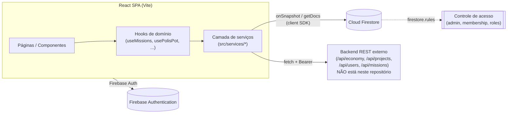

# TYTO.club — Arquitetura do Projeto

> Plataforma de gamificação comunitária (UI em português) onde membros acumulam XP, sobem de
> patente, ganham "Dracmas" (moeda interna) cumprindo missões, lideram/participam de projetos e
> operam uma camada de governança simulada (Reinos, Polis, eleições, tribunais monetários). Frontend
> em React 19 + TypeScript + Vite + Tailwind, com Firebase (Auth + Firestore) como base de dados
> primária e um backend REST externo para regras de negócio que exigem lógica server-side.

## Sumário

1. [Stack técnico](#stack-técnico)
2. [Visão geral do sistema](#visão-geral-do-sistema)
3. [Duas vias de acesso a dados](#duas-vias-de-acesso-a-dados)
4. [Bootstrap e roteamento](#bootstrap-e-roteamento)
5. [Modelo de domínio](#modelo-de-domínio)
6. [Modelo de segurança (Firestore Rules)](#modelo-de-segurança-firestore-rules)
7. [Padrões de frontend](#padrões-de-frontend)
8. [Estrutura de diretórios](#estrutura-de-diretórios)
9. [Sistema visual](#sistema-visual)
10. [Decisões de engenharia notáveis](#decisões-de-engenharia-notáveis)
11. [Limitações conhecidas](#limitações-conhecidas)

---

## Stack técnico

| Camada | Tecnologia |
|---|---|
| UI | React 19, TypeScript, Vite 7, Tailwind CSS 3 |
| Componentes | Radix UI (`@radix-ui/react-dialog`), `class-variance-authority` + `tailwind-merge` (padrão `cva`/`cn`), `lucide-react` |
| Compilador | Babel + `babel-plugin-react-compiler` (React Compiler habilitado no build) |
| Roteamento | `react-router-dom` v7 |
| Dados/Auth | Firebase Auth + Firestore (`firebase` SDK v12, client-side) |
| Gráficos | `recharts` |
| Utilitários de domínio | `blueimp-md5`, `katex` (LaTeX no Research Lab), `sql-formatter` / `node-sql-parser` (ferramenta SQL no Developer Tools) |
| Notificações UI | `react-hot-toast` |
| Lint | ESLint 9 (flat config) + `typescript-eslint` |

Não há suíte de testes configurada (sem test runner, sem arquivos `*.test.*`/`*.spec.*`).

---

## Visão geral do sistema



O frontend fala diretamente com dois backends distintos, e a distinção importa para quem for
mexer no código:

- **Firestore direto (client SDK)** — a maior parte das leituras e algumas escritas (ex.:
  conquistas) vão do navegador direto para o Firestore via `src/services/firebase.ts` (`db`,
  `auth`). Dados em tempo real (ex.: o documento do usuário logado) são assinados com
  `onSnapshot`.
- **Backend REST externo** — `economyService.ts`, `projectService.ts`, `userService.ts` e
  `missionService.ts` chamam endpoints HTTP (`/api/economy/*`, `/api/projects`, `/api/users`,
  `/api/missions`) em `VITE_API_URL` (default `http://localhost:3001`), autenticados com um ID
  token do Firebase como Bearer header. **Esse backend não vive neste repositório** — um app
  Express em `server/` existiu aqui e foi removido no commit `4ec6c6a`; `express`/`cors`/
  `firebase-admin` continuam em `package.json` como dependências órfãs. Funcionalidades de
  economia/projetos/usuários/missões exigem esse backend rodando à parte.

---

## Bootstrap e roteamento

`src/App.tsx` é o composition root:

- `onAuthStateChanged` alimenta um único estado `user`; enquanto logado, o documento
  `users/{uid}` é assinado via `onSnapshot` em `userData`, que desce como prop para as páginas
  (não há Context de usuário — é prop drilling deliberado).
- `useAchievementEngine`, `useMerchantAchievementEngine` e `useDuxMentorshipPayout` rodam
  globalmente a cada mudança de auth/userData.
- `applyMonthlyFee()` dispara uma vez por login para cobrar a taxa mensal recorrente de Dracmas
  via backend externo; o resultado (`charged` / `zero_balance` / `first_month` / silencioso) vira
  toast — mas só para os casos com valor informativo real, para não repetir o mesmo aviso todo
  login.
- Um saldo negativo detectado no snapshot do usuário suspende a conta automaticamente
  (`suspended: true`), e a suspensão bloqueia toda a árvore de rotas com `SuspendedScreen`.
- O gate de autenticação é feito **por `<Route>`**, não por um wrapper — cada rota privada testa
  `user ? <Página/> : <Navigate to="/login" />` individualmente. `/login` e `/hierarquia` são as
  únicas rotas públicas.
- Rotas de membro (ex. `/missions`, `/projects`, `/vagas`, `/dominatium`, `/tribuno`,
  `/conselho`, `/polis-ranking`, `/credito`, `/carteira`, `/eleicoes`) são adicionalmente
  envolvidas por `<RequireMemberAccount>`, que separa contas de membro de contas `merchant`
  (mercadores acessam `MerchantDashboard`/`SalesHub`, não o dashboard de membro).

---

## Modelo de domínio

O projeto simula, com bastante fidelidade, a estrutura de governança de uma "nação" gamificada.
Os nomes vêm de um vocabulário romano/helênico e são regidos por um conjunto de regulamentos
internos em `docs/*.md` (a "Carta Institucional" e seus complementos) — o código implementa esses
regulamentos, não o contrário.

### Progressão individual

- **XP e patentes** — `src/constants/tiers.ts` define `CLAN_TIERS`, uma escada de 14 patentes
  (Neófito → Dominador) por limiar de XP, cada uma com perks concretos (acesso a projetos,
  bônus de freelancer, hardware, sociedade na holding). `getUserTier`/`getNextTier` resolvem a
  patente atual/seguinte a partir do XP acumulado. XP é, por regulamento (`docs/XP.md`),
  irrevogável.
- **Crédito de Mérito** (`docs/CREDITO_DE_MERITO.md`) — histórico de desempenho de quem ainda
  não é membro, convertido em XP no momento da filiação (`src/pages/CreditoPage.tsx`,
  `useProtectionCreditEligibility`).
- **Conquistas (achievements)** — `src/services/achievementService.ts` concede conquistas dentro
  de uma `runTransaction` do Firestore (não `arrayUnion`), porque `useAchievementEngine` dispara
  dois `useEffect`s que podem chamar `checkAndGrantAchievements` quase simultaneamente; a
  transação lê o estado committed em vez do `userData` em memória (potencialmente stale) e
  também deduplica/repara entradas duplicadas de `unlockedAchievements` gravadas no passado.
  Definições e condições vivem em `src/constants/achievementsList.ts`
  (e `merchantAchievementsList.ts` para a versão de mercadores).

### Economia (Dracmas)

- Cada membro tem **um único saldo** de Dracmas (`docs/DRACMAS.md`) — sem sub-contas. Toda
  movimentação é registrada em `transactions`/`ledger` e lida via `economyService.getTransactions()`
  / `useLedgerEntries`, `useLedgerWindow`.
- Taxa mensal automática (`applyMonthlyFee`), suspensão por saldo negativo, empréstimos
  (`nationalLoanService`, `useNationalLoans`, `loanEngine.ts`), pedidos de emissão monetária
  ("mint") nacional (`nationalMintRequestService`, `useApprovedNationalMintRequests`,
  `useGlobalMintFeed`) e reserva de dinheiro real lastreando a moeda (`reservaDinheiroRealService`,
  `useReservaDinheiroReal`) compõem a política monetária simulada, descrita em
  `docs/DOMINATIUM.md`.
- Potes/orçamentos em dois níveis: `national_pots` (Reino) e `polis_pots` (Polis), cada um com
  seu próprio fluxo de pedido de orçamento (`polisBudgetRequestService` /
  `usePolisBudgetRequests`).

### Governança territorial

- **Reino** (país) → **Polis** (cidade/região dentro do país). `src/types/reino.ts` e
  `src/types/polis.ts` modelam a hierarquia; `countryCode` no documento do usuário fixa a
  filiação territorial.
- **Colônias e Metrópoles** (`docs/COLONIAS_E_METROPOLES.md`) — um Reino com menos de 10 membros
  ativos é Colônia (sem Conselho Régio próprio) e pode ser vinculado a uma Metrópole; a
  designação é sempre manual por um admin, nunca derivada automaticamente (o cadastro de membro
  não guarda nenhum rastro de proveniência/indicação) — ver `src/types/reino.ts` e
  `coloniaStatus.ts`.
- **Cargos eletivos** (`docs/ELEICOES.md`, `useEleicoes`, `eleicaoEngine.ts`,
  `eleicaoEligibility.ts`):
  - **Tribuno** — administra uma Polis (`docs/TRIBUNO.md`, `TribunoPanel.tsx`), nomeia papéis
    operacionais locais (`operationalRoles` em `Polis`).
  - **Conselheiro** (Conselho Régio) — nível de Reino, aprova orçamento e políticas
    (`ConselheiroPanel.tsx`, `conselhoService.ts`, `conselhoImpeachmentService.ts`,
    `conselhoExclusionService.ts` para impeachment/exclusão de conselheiros).
  - **Dux Vecturium** — mentor institucional, com registro de mentorias e payout associado
    (`duxMentoriaService.ts`, `useDuxMentorshipPayout`, `docs/REGISTRO_DUX.md`).
  - **Guarda Pretoriana** — corpo técnico de cibersegurança da comunidade
    (`docs/GUARDA_PRETORIANA.md`, `guardaPretorianaService.ts`).
  - **Mercador** — único papel institucional aberto a não-membros do clube, com escopo comercial
    próprio (`docs/MERCADOR.md`, `MerchantDashboard.tsx`, `merchantSalesService.ts`).
  - Mandatos têm prazo e podem ser revogados por voto (`mandateService.ts`,
    `voteMandateService.ts`, `useMandates`).
- **Dominatium** (`docs/DOMINATIUM.md`) — o "tribunal" monetário/institucional: fluxo de mint
  régio, direito de contestação de emissão, alertas institucionais e reconhecimento de parcerias
  inter-Reino (`dominatiumCaseService.ts`, `DominatiumCentral.tsx`,
  `useDominatiumRepresentatives`, `useCountryDominatiumWeights`).
- Disputas e mediação: `disputeService.ts`, `economicDisputeService.ts`,
  `polisMediationService.ts`, `polisConflictService.ts`, `reinoPolisConflicts` — mecanismos de
  resolução de conflito em múltiplas escalas (indivíduo, Polis, Reino).
- Relatórios semestrais de prestação de contas: `polisSemesterReportService.ts`,
  `reinoSemesterReportService.ts`.

### Projetos e acesso

- Projetos têm um mapa `members: { [uid]: 'leader' | 'partner' | 'contributor' }`
  (`src/config/projectCodex.ts`). `firestore.rules` deriva permissões diretamente desse mapa +
  uma coleção top-level `admins/{uid}` para admins globais: leitura exige membership ou admin,
  escrita exige leader/admin, e missões escopadas a um projeto são adicionalmente region-locked
  por `targetCountries` vs. o `countryCode` do usuário.
- Métricas de negócio ricas por projeto (MRR/ARR, burn rate, DAU/MAU, churn, health score,
  CAC/LTV/ROI) alimentam o **IPT** (Índice de Progresso do Projeto) via `utils/ipt.ts`.
- Integração com ClickUp por projeto (`clickupWorkspaceId`) alimenta o Demand Tracker
  (`ClickUpDemandTracker.tsx`, `clickupService.ts`).
- Vagas de projeto e candidaturas: `vagaService.ts`, `useVagas`, `Vagas.tsx`.

### Marketplace, mercadores e vendas

- `Marketplace.jsx` + `marketplace_services`/`marketplaceListings`/`marketplacePurchases` no
  Firestore para bens/serviços internos.
- Mercadores (contas `accountType: 'merchant'`) têm dashboard, conquistas e funil de vendas
  próprios: `MerchantDashboard.tsx`, `MerchantAchievementsPanel.tsx`, `merchantSalesService.ts`,
  `useMerchantSales`.
- **Sales Hub** — ferramenta de PDV/checkout para vendas de projeto, com cálculo de preço/print
  (`salesHubCalc.ts`, `salesHubMetrics.ts`, `salesHubPrint.ts`, `useSalesHub`,
  `useSalesHubSession`).

### Research Lab

Ambiente de resolução/ensino de problemas técnicos (matemática, física, engenharia, ML,
conversões), renderizando LaTeX via `katex`: `useResearchLab*` hooks e
`researchLab{Data,Math,Physics,Engineering,ML,Converters}.ts` em `src/utils`.

### Developer Tools

`src/pages/DeveloperTools.tsx` usa um registry genérico: o array `DEV_TOOLS` (id, nome,
descrição, ícone, `Component`) dirige busca, grid de cards e sidebar. Ferramentas atuais: JSON
Formatter, JWT Decoder, UUID Generator, Hash Generator, Base64 Encoder/Decoder, Timestamp
Converter, Fake Data Generator, SQL Validator. Adicionar uma ferramenta = criar um componente
autocontido em `src/components/dev-tools/` (usando o kit compartilhado `DevToolsUI.tsx`:
`ToolPanel`, `CopyButton`, `ErrorBanner`/`SuccessBanner`/`InfoBanner`) + uma entrada em
`DEV_TOOLS`. Não exige mudanças de rota.

### i18n

`src/hooks/useTranslation.tsx` expõe `LanguageProvider`/`useTranslation`, resolvendo `pt`/`en` a
partir do campo `locale` do usuário (fallback: idioma do browser, default `en`). Strings
centralizadas em `src/config/locales.ts` (~1.450 linhas).

---

## Modelo de segurança (Firestore Rules)

`firestore.rules` (951 linhas) é a autoridade real de controle de acesso — o cliente não confia
em si mesmo. Padrões centrais:

```
isAuthenticated()        // request.auth != null
isAdmin()                 // users/{uid}.admin == true
getUserCountryCode()      // users/{uid}.countryCode
getUserPolisId()          // users/{uid}.polisId
getProjectRole(projectData) // project_stats/{id}.members[uid]
isNotModifyingSensitiveFields() // bloqueia diff em admin/tier/role/saldo/dracmas/
                                 // conselheiro/duxVecturium/tribuno/dominatium
hasNoSensitiveFieldsOnCreate()  // um doc novo não pode nascer já admin/com tier != 'Iniciante'
suspendedTransitionOk()         // uma conta suspensa não pode "auto-dessuspender"
```

Mais de 45 coleções têm regras dedicadas — de `users`/`project_stats`/`marketplace_services` a
toda a camada de governança (`polis_pots`, `polis_budget_requests`, `eleicoes`, `mandates`,
`conselho_impeachments`, `dominatium_cases`, `guarda_pretoriana_members`,
`reserva_dinheiro_real`, `reino_polis_conflicts`, etc.), cada uma derivando leitura/escrita de
uma combinação de: autenticação, membership (Polis/Reino/projeto), cargo eletivo ativo, ou admin
global. Campos sensíveis (saldo, tier, cargos) nunca são editáveis pelo próprio usuário via
escrita direta — apenas por transações server-side/admin, o que fecha o principal vetor de trapaça
num sistema onde XP e Dracmas valem "moeda real" dentro da comunidade.

---

## Padrões de frontend

- **Serviço por domínio** — cada agregado (`polisService`, `reinoService`, `electionService`,
  `dominatiumCaseService`, ...) tem seu próprio arquivo em `src/services/`, encapsulando as
  chamadas ao Firestore/backend. Nenhuma página fala com `db`/`fetch` diretamente para lógica de
  domínio.
- **Hook por consulta reativa** — `src/hooks/` tem ~70 hooks, quase todos um wrapper fino de
  `onSnapshot`/`getDocs` de um serviço, memoizando e tipando o resultado para um componente (ex.
  `usePolisPot`, `useMandates`, `useCountryRoster`). Isso mantém páginas declarativas e evita
  lógica de assinatura duplicada.
- **Tipos ricos por domínio** — `src/types/` espelha cada coleção do Firestore com uma interface
  TypeScript própria (ex. `polisBudgetRequest.ts`, `nationalLoan.ts`, `dominatiumCase.ts`),
  fazendo o compilador validar o shape dos documentos.
- **Transações para operações concorrentes** — sempre que uma escrita pode ser disparada por
  múltiplos efeitos/usuários ao mesmo tempo (conquistas, saldo, cargos), o código usa
  `runTransaction` em vez de `updateDoc`/`arrayUnion` simples.
- **Design de UI compartilhado** — `src/components/ui/` (primitivas), `DevToolsUI.tsx` (kit da
  página de ferramentas), `libs/utils.ts` (`cn()` via `clsx` + `tailwind-merge`).

---

## Estrutura de diretórios

```
src/
├── api/economy/           # helpers client-side para chamadas de economia
├── components/            # componentes de UI, organizados por domínio
│   ├── cmt-dashboard/  council/  credito/  dev-tools/  dominatium/
│   ├── marketplace/  modals/  project-dashboard/  research-lab/
│   ├── sales-hub/  shared/  statement/  tribuno/  ui/  wallet/
│   └── *.tsx               # componentes de topo (painéis, modais, nav)
├── config/                 # locales.ts, projectCodex.ts, researchFields.ts
├── constants/               # tiers, roles, achievements, countries, economy
├── data/
├── hooks/                   # ~70 hooks de domínio (um por query/feature)
├── libs/                    # utils.ts (cn, helpers genéricos)
├── pages/                   # uma página por rota (ver App.tsx)
├── services/                # camada de acesso a dados, um arquivo por agregado
├── styles/                  # temas sazonais/eventos
├── types/                   # interfaces TS espelhando coleções do Firestore
└── utils/                   # motores/calculadoras de domínio (ipt, IPP, eleição,
                              # empréstimo, fluxo de caixa, research lab, etc.)

docs/                        # "Carta Institucional" + regulamentos complementares
                              # (fonte da verdade normativa do domínio simulado)
firestore.rules              # controle de acesso (fonte da verdade de segurança)
```

---

## Sistema visual

Tema "cyberpunk" escuro consistente em todas as páginas: fundos quase-pretos (`#020617` /
`#05000d`), cards com borda semi-transparente (`bg-white/[0.03] border-white/10`), cores de
destaque violeta/ciano/esmeralda/rosa, labels em caixa alta com tracking, títulos `font-black`.

---

## Decisões de engenharia notáveis

- **Duas fontes de verdade normativa, uma técnica** — o comportamento do domínio (o que é uma
  Polis, quando alguém vira Metrópole, como funciona um impeachment) é especificado em prosa em
  `docs/*.md` antes de existir em código; o código é a implementação desses regulamentos, e
  comentários no código frequentemente citam o artigo/parágrafo que justificam uma regra que não
  seria óbvia só lendo a lógica.
- **Sem Context para o usuário logado** — `userData` desce como prop explícita em vez de Context,
  uma escolha deliberada de simplicidade sobre "boilerplate zero" em uma árvore de rotas onde
  quase toda página já recebe `userData` como parâmetro de qualquer forma.
- **Rules como camada de segurança real, não só de conveniência** — campos como saldo/tier/cargo
  são protegidos por `firestore.rules`, não apenas escondidos na UI; a suspensão automática por
  saldo negativo é enforced tanto no client (`App.tsx`) quanto nas rules
  (`suspendedTransitionOk()`).
- **Auto-cura de dados inconsistentes** — `achievementService` não apenas concede conquistas
  novas, mas deduplica registros corrompidos por corridas passadas toda vez que roda,
  eliminando a necessidade de uma migração one-off.

---

## Limitações conhecidas

- Sem suíte de testes automatizados.
- O backend REST (`/api/economy`, `/api/projects`, `/api/users`, `/api/missions`) não está neste
  repositório — funcionalidades que dependem dele exigem esse serviço rodando separadamente.
- Vários `.md` na raiz do repositório (`ARCHITECTURE_SUMMARY.md`, `FLOWS.md`,
  `HOOKS_GUIDE.md`, etc.) descrevem uma arquitetura anterior/aspiracional (ex. layout Next.js
  `app/api/`) que não corresponde mais ao código atual — este documento foi escrito a partir do
  código-fonte e deve ser preferido como referência.
